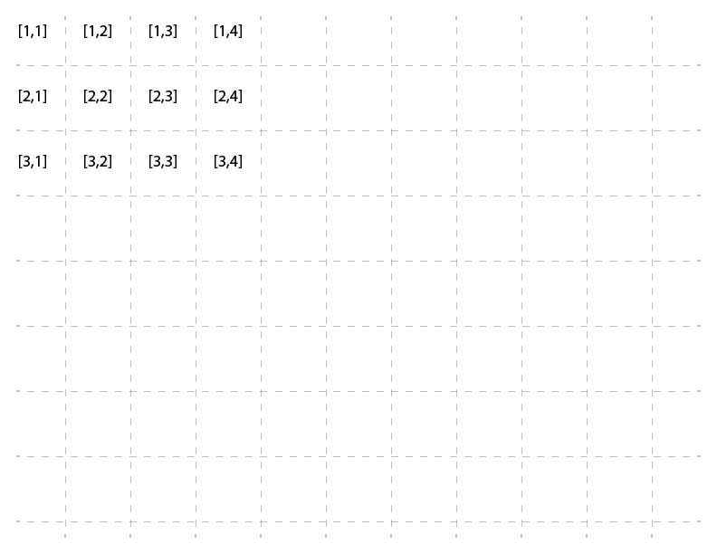
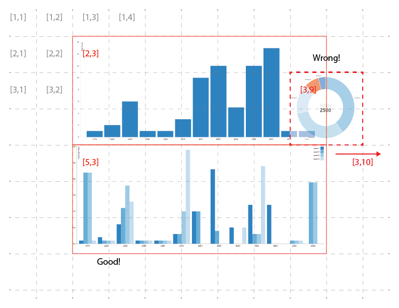

# Address

Mandrill now supports dynamic layout creation, thanks to a piece of Java Script library called Gridster. What Gridster is doing for us, is that it divides the whole page into a grid of cells. Each cell is <b>100px x 100px</b>. Starting in the top/left corner of the screen, each chart, image, legend added to the report and visualized in the window, now has an address. Rows and columns are numbered sequentially so top/left is [1,1]. Kind of like this: 

Now, you don't have to specify an address for each chart. If you don't one will be assigned automatically. By default its [1,1], and if multiple charts have the same address then they will just slide to the right in order that they were added to canvas since charts cannot overlap each other. 

<blockquote>
It's recommended to specify an address for a chart if you want it to be "attached" to a given location. If you don't specify an address, and canvas get's redrawn (happens every time data gets updated), your charts will get all moved back to where they started. If you want them to stick, create a layout using address property for each, and they will stay there.
</blockquote>

Something to keep in mind when specifying the address for a chart. It's address is relative to charts top/left corner. So for example telling a chart to be slotted at [2,3] would result in something like this: 

Each chart occupies a certain number of cells based on its width and height. For example, chart in the picture above is 7 cells wide and 3 cells tall. That means that its size was something between 601-700px for Width and 201-300 for Height. It is important to understand that the next chart's address cannot occupy a cell that is already taken by something else, or the chart will be automatically moved to the right of one that its trying to overlap. For example: 

So what would happen with the Donut Chart above is that it would get automatically moved to the right into [3,10] spot. 
