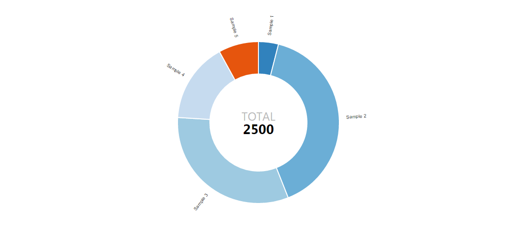
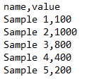
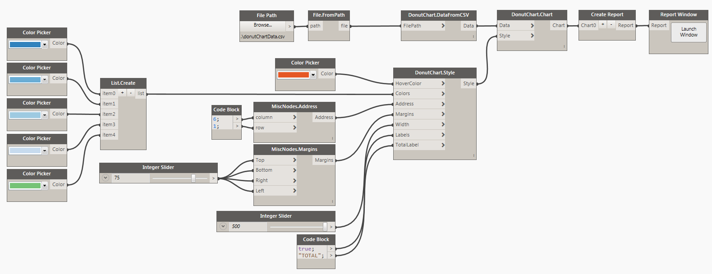
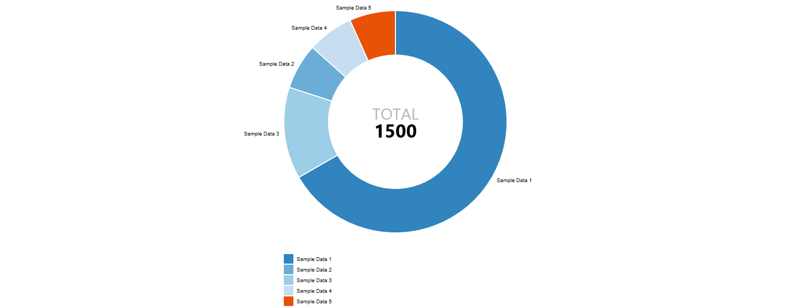

#Donut Chart

##Data:

There are two ways of defining data for a Donut Chart. First is to use a <b>CSV</b> file that was formatted in the following way: 

* First Column is always <b>Name</b> of the data point.
* Second Column is always the numerical <b>Value</b> for the data point.

###Example: 

Another possible way is to define the data in Dynamo directly and then use the node <b>DonutChart.Data</b> to define all of the desired data points. Here's a potential sample of defining data in Dynamo:

##Style:

Donut Chart Style has a few things that can be set optionally to control the visual appearance of the chart. First two inputs are for controling a color. You can either use a Dynamo Color node or a little bit of DesignScript syntax and a Code Block to define that input. Example: `DSCore.Color.ByARGB(1,220,180,20)`. Colors input accepts a list of colors if you wish to give each slice of the chart/data its own color. <b>Width</b> and <b>Height</b> are integer inputs that by default are set to 1000px x 500px. The actual size of the chart is always a little smaller because of margins required for handling label graphics etc. There is also a boolean inputs for <b>Labels</b>. If set to true, labels will appear around the chart in a sun-ray style. If you are using Labels, you might want to set the margins for a chart to create space around it. Please see [this](margins.md) for more info on Margins. Please see this [page](address.md) for more info on Address.  

##Other:

###Legends:

<blockquote>
Donut Chart no longer has a legend that can be toggled on and off. It was intead repleaced with a whole new component called legend. Please see the [legend](legend.md) page for more info.
</blockquote>

