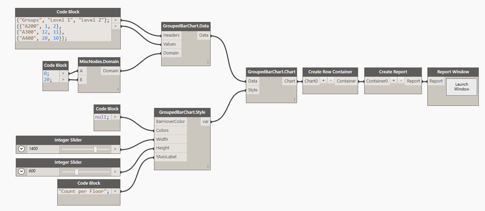

#Grouped Bar Chart

##Data:

There are two ways of defining data for Grouped Bar Chart. You can use a CSV file formatted in the following manner: 

* First row is always <b>Headers</b>. Headers contain names of individual bars in each group. So in our example its Level 1, Level 2...etc.
* All of the consecutive rows are considered data points. These are all of the <b>Groups</b> with each row starting with a Group Name and then values for each data point (in our case Level). 

###Example of CSV data:

Another way to define data is to generate it from a list directly in Dynamo. You can do it like so: 

##Style:

There are couple of things that you can define for the appearance of the Grouped Bar Chart. First is a <b>BarHoverColor</b>. That's a color that a bar will change to when you hover your mouse over. You can use a Dynamo Color node to define that input or you can use the Design Script syntax like so: `DSCore.Color.ByARGB(1,100,100,100)`. Second input is a list of colors. Each bar inside of the Group can have a specific color of your choosing, or if you supply a `null` value the default color scheme will be applied ([D3 Categorical Colors] (http://bl.ocks.org/aaizemberg/78bd3dade9593896a59d)). <b>Category20c</b> is the default color scheme. 

##Other:
