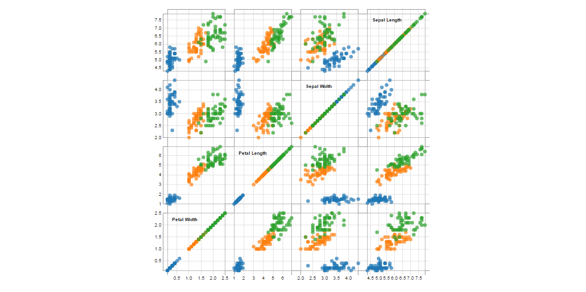
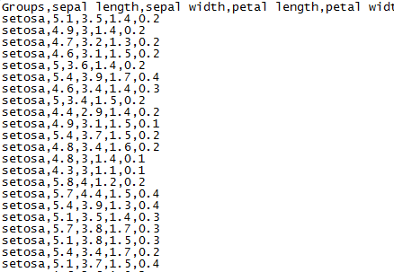

#Scatter Plot Matrix

##Data:

There are two ways of defining data for Scatter Plot Matrix Chart. You can use a CSV file formatted in the following manner: 

* First row is always <b>Headers</b>. Headers contain names of individual data points in each group or if you wish for each parameter. In our example its the different properties of the flowers.
* All of the consecutive rows are considered data points. These are all of the <b>Dots</b> with each row starting with a Name and then values for each data point. 

###Example of CSV data:

Another way to define data is to generate it from a list directly in Dynamo. You can do it like so: 

##Style:

There are couple of things that you can define for the appearance of the Scatter Plot Matrix Chart. First is a <b>Colors</b>. You can use a Dynamo Color node to define that input or you can use the Design Script syntax like so: `DSCore.Color.ByARGB(1,100,100,100)`. Just make sure to put them into a list. Remaining input is an integer for <b>Width</b> with a default value 1000px. Address input can be used to place the chart in a specific location on a page. Grid address represents charts top/left corner. Please see this [page](address.md) for more info on Address. 

##Other:

<blockquote>
When defining Colors for Style object keep in mind that due to the nature of Scatter Plot Matrix and the fact that each "row" of data is being displayed multiple times in different relational plots, the colors are actually per "row". I am saying this, because you might have a lot of data rows in the CSV file, and creating a list of custom colors might be tedious. It's best to just leave it undefined and custom colors will be assigned automatically.
</blockquote>
